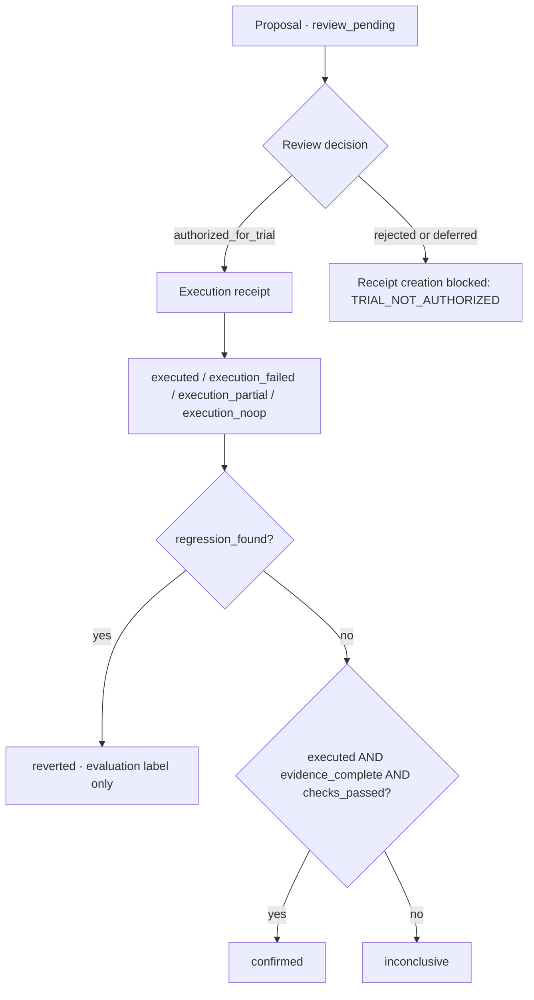

# AgentLens Review Kit

**English** · [简体中文 →](README.zh-CN.md)

### Make AI-assisted changes reviewable, one decision at a time.

A small TypeScript module that separates **what was proposed, what a person allowed, what happened, and what the evidence supports**. Run the review rules around an AI workflow without a model, API key, or private service.

**Built independently by Lei Qian · AI Product Engineer**

Adapted from lifecycle concepts in my private AgentLens workbench. This is an independent engineering sample with a reduced contract and additional input checks, not the complete application.

[Core example](#core-example) · [State flow](#state-flow) · [Run locally](#run-locally) · [Design and limits](#design-and-limits)

## The idea in 30 seconds

Imagine an AI assistant proposes a change to a creative brief. A person permits a trial, an external system applies the change, and a reviewer checks the result. **Permission to try is not proof that the change worked.**

| Product question | Record | What this demonstrates |
| --- | --- | --- |
| What should change, and why? | `ReviewProposal` | Explicit candidate, version, and reason |
| May this proposal be tried? | `ReviewDecision` | Allow, reject, or defer; preserve the decision |
| What happened in the trial? | `ExecutionReceipt` | Completed, failed, partial, or no-op execution |
| What can we conclude? | `EvaluationResult` | Confirmed, inconclusive, or regression flagged |

For a technical review, this sample makes my **product modeling, runtime validation, traceable record design, and rule testing** directly inspectable. The factories create records; they do not perform the change or authenticate a reviewer.

## State flow



This describes factory calls and evaluation rules, not a persistent workflow engine. Rejected or deferred decisions cannot produce execution receipts. Regression takes precedence. **`reverted` is an assessment label: the module does not roll back a change.**

## Core example

**One trial, four records, an honest conclusion.** This synthetic example records a completed trial, but its evaluation stays inconclusive because evidence is missing.

After cloning, save this as `demo.mjs` in the repository root and run `node demo.mjs` with **Node.js 24**. No install step is needed.

```js
import {
  createProposal,
  createReviewDecision,
  createExecutionReceipt,
  createEvaluationResult,
} from './src/index.ts';

const proposal = createProposal({
  id: 'proposal-1', at: '2026-09-19T09:00:00.000Z',
  candidate_ref: 'brief-revision-1', version: 1,
  reason: 'Try a clearer opening while preserving the author intent.',
});

const decision = createReviewDecision(proposal, {
  id: 'decision-1', at: '2026-09-19T09:01:00.000Z',
  decided_by: 'local_user', status: 'authorized_for_trial',
});

const execution = createExecutionReceipt(decision, {
  id: 'execution-1', at: '2026-09-19T09:02:00.000Z',
  status: 'executed', change_ref: 'synthetic-change-1',
});

const evaluation = createEvaluationResult(execution, {
  id: 'evaluation-1', at: '2026-09-19T09:03:00.000Z',
  candidate_ref: proposal.candidate_ref,
  evidence_complete: false, checks_passed: true, regression_found: false,
});

console.log([proposal.status, decision.status, execution.status, evaluation.status].join(' → '));
console.log('Parent linked:', evaluation.execution_hash === execution.content_hash);
```

Expected output:

```text
review_pending → authorized_for_trial → executed → inconclusive
Parent linked: true
```

Change `evidence_complete` to `true`: this example returns `confirmed`. Change the decision to `rejected` instead: receipt creation throws `TRIAL_NOT_AUTHORIZED`. These are workflow rules, not model-quality scores.

## Run locally

Requires **Node.js 24** (`>=24 <25`). Zero package dependencies; Node supplies native TypeScript execution, cryptography, and the test runner.

```sh
git clone https://github.com/a1989524/agentlens-review-kit.git
cd agentlens-review-kit
npm test
npm run example
```

The [behavior tests](tests/lifecycle.test.mjs) cover authorization gates, invalid inputs, record integrity, time ordering, candidate mismatches, and evaluation outcomes. Native TypeScript execution does not replace a compiler check for a larger integration.

### Four reproducible scenarios

| Scenario | Decision / execution | Final result |
| --- | --- | --- |
| Approved trial | Allowed; execution completes; evaluation conditions met | `confirmed` |
| Rejected proposal | Receipt creation is actually attempted and refused | `TRIAL_NOT_AUTHORIZED`; no execution receipt |
| Failed execution | Allowed; `execution_failed` | `inconclusive` |
| Missing evidence | Allowed; `executed`; evidence incomplete | `inconclusive` |

All inputs are **synthetic and deterministic**. These examples make no model calls or network requests and do not measure real-world performance. Inspect the [scenario definitions](examples/scenarios.mjs), or export the records for a static replay:

```sh
node scripts/export-scenarios.mjs scenarios.json
```

## Design and limits

| Choice | Why I made it | Tradeoff |
| --- | --- | --- |
| Separate records for each stage | Preserve distinct judgments instead of overwriting one status | Consumers assemble the history |
| Explicit timestamps and parent references | Reproducible runs and inspectable relationships | Callers supply IDs and timestamps; uniqueness is not enforced |
| Frozen records with SHA-256 digests | Check content consistency and retain parent digests | Hashes are not signatures or a tamper-proof audit log |
| Runtime checks at factory boundaries | Reject malformed input and invalid transitions from JavaScript too | A reduced contract, not a complete workflow validator |
| Conservative evaluation | Keep missing evidence uncertain; prioritize regression | Signals are caller assertions, not independently collected proof |

**Integration boundaries:**

- `local_user` is a role field, **not authentication or access control**. The caller must establish who may decide.
- A malicious party can alter a record and recompute its digest. Parent ID/hash references do not independently authenticate an entire historical chain.
- There is no durable storage, concurrency arbitration, cross-process replay prevention, or distributed transaction support.
- Receipts describe caller-reported actions. Evaluation booleans do not establish statistical sufficiency; `reverted` performs no rollback.
- Static replay from these examples is a demonstration, not a live AgentLens service.

## Read the implementation

| Entry | Purpose |
| --- | --- |
| [Public API](src/index.ts) | Four record factories, `hashRecord`, and `verifyRecord` |
| [Record types](src/types.ts) | Fields, states, and parent relationships |
| [Lifecycle rules](src/lifecycle.ts) | Runtime checks and evaluation decisions |
| [Content hashing](src/hash.ts) | Canonical JSON hashing and digest verification |
| [Executable scenarios](examples/scenarios.mjs) | Complete calls for four replay scenarios |
| [Behavior tests](tests/lifecycle.test.mjs) | Inspectable expectations and failure cases |

Independently designed and implemented by **Lei Qian**. [MIT licensed](LICENSE); no third-party source is bundled.

---

**English** · [切换到简体中文 →](README.zh-CN.md)
