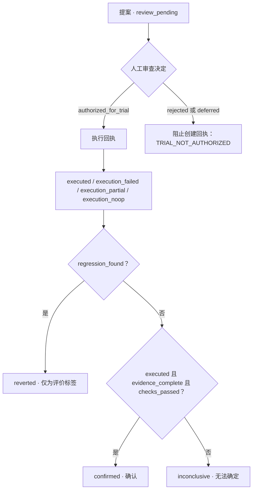

# AgentLens Review Kit

[English →](README.md) · **简体中文**

### 让 AI 辅助变更中的每一次决定，都有据可查。

一个小型 TypeScript 模块，将**提出了什么、人工允许什么、实际发生什么、证据支持什么结论**分别记录。无需模型、API 密钥或私人服务，即可运行 AI 工作流周边的审查规则示例。

**钱磊独立完成 · AI Product Engineer（AI 产品工程师）**

从我的私人 AgentLens 工作台的生命周期概念中适配而来。这是采用精简合同、补充输入检查的独立工程示例，不是完整应用。

[核心示例](#核心示例) · [状态流程图](#状态流程图) · [本地运行](#本地运行) · [设计取舍与边界](#设计取舍与边界)

## 30 秒理解这个模块

假设 AI 助手建议修改一份创作简报：人工允许试用，外部系统应用变更，再由审查者检查结果。**允许尝试，并不代表变更已经有效。**

| 产品问题 | 对应记录 | 模块展示的能力 |
| --- | --- | --- |
| 要改什么，为什么？ | `ReviewProposal` | 明确候选对象、版本和原因 |
| 这个提案可以试用吗？ | `ReviewDecision` | 允许、拒绝或暂缓；保留独立决定 |
| 试用过程中发生了什么？ | `ExecutionReceipt` | 区分完成、失败、部分完成和无操作 |
| 现在能得出什么结论？ | `EvaluationResult` | 确认、证据不足，或标记回归 |

对于技术评审，这个示例提供了可以直接检查的**产品建模、运行时校验、记录关联设计和规则测试**。工厂函数负责生成记录，不负责执行变更，也不验证审查者身份。

## 状态流程图



图中描述的是工厂函数调用与评价规则，不是持久化工作流引擎。被拒绝或暂缓的决定不能生成执行回执；发现回归时，其优先级高于其他信号。**`reverted` 只是评价标签，模块不会实际回滚变更。**

## 核心示例

**一次试用、四份记录、一个与证据相符的结论。** 以下合成示例记录一次已完成的试用，但由于证据缺失，最终评价仍为无法确定。

克隆仓库后，把代码保存为仓库根目录下的 `demo.mjs`，使用 **Node.js 24** 执行 `node demo.mjs`。不需要安装依赖。

```js
import {
  createProposal,
  createReviewDecision,
  createExecutionReceipt,
  createEvaluationResult,
} from './src/index.ts';

const proposal = createProposal({
  id: 'proposal-1', at: '2026-09-19T09:00:00.000Z',
  candidate_ref: 'brief-revision-1', version: 1,
  reason: 'Try a clearer opening while preserving the author intent.',
});

const decision = createReviewDecision(proposal, {
  id: 'decision-1', at: '2026-09-19T09:01:00.000Z',
  decided_by: 'local_user', status: 'authorized_for_trial',
});

const execution = createExecutionReceipt(decision, {
  id: 'execution-1', at: '2026-09-19T09:02:00.000Z',
  status: 'executed', change_ref: 'synthetic-change-1',
});

const evaluation = createEvaluationResult(execution, {
  id: 'evaluation-1', at: '2026-09-19T09:03:00.000Z',
  candidate_ref: proposal.candidate_ref,
  evidence_complete: false, checks_passed: true, regression_found: false,
});

console.log([proposal.status, decision.status, execution.status, evaluation.status].join(' → '));
console.log('Parent linked:', evaluation.execution_hash === execution.content_hash);
```

预期输出：

```text
review_pending → authorized_for_trial → executed → inconclusive
Parent linked: true
```

提案原因是“在保留作者意图的前提下，尝试更清晰的开头”；`Parent linked: true` 表示评价记录中的父记录摘要与执行回执一致。

将 `evidence_complete` 改为 `true`，此时返回 `confirmed`；把审查决定改为 `rejected`，创建执行回执会抛出 `TRIAL_NOT_AUTHORIZED`。这些结果反映工作流规则，不是模型质量分数。

## 本地运行

需要 **Node.js 24**（`>=24 <25`）。没有包依赖；原生 TypeScript 执行、密码学函数和测试运行器均由 Node 提供。

```sh
git clone https://github.com/a1989524/agentlens-review-kit.git
cd agentlens-review-kit
npm test
npm run example
```

[行为测试](tests/lifecycle.test.mjs)覆盖授权门、无效输入、记录完整性、时间先后关系、候选对象不匹配和评价结果。在更大的集成项目中，原生 TypeScript 执行不能替代编译器类型检查。

### 四个可复现的场景

| 场景 | 决定与执行 | 最终结果 |
| --- | --- | --- |
| 获准试用 | 允许；执行完成；满足评价条件 | `confirmed` |
| 提案被拒绝 | 实际尝试创建执行回执，并捕获拒绝结果 | `TRIAL_NOT_AUTHORIZED`；不产生执行回执 |
| 执行失败 | 允许；`execution_failed` | `inconclusive` |
| 证据不足 | 允许；`executed`；评价证据不完整 | `inconclusive` |

所有输入均为**确定性的合成数据**。示例不调用模型、不发起网络请求，也不衡量真实业务表现。可以阅读[场景定义](examples/scenarios.mjs)，或导出相同记录用于静态回放：

```sh
node scripts/export-scenarios.mjs scenarios.json
```

## 设计取舍与边界

| 设计选择 | 我的考虑 | 代价与限制 |
| --- | --- | --- |
| 分开记录各个阶段 | 保留不同阶段的判断，避免反复覆盖一个状态 | 消费方需要自行组装历史 |
| 显式时间戳和父记录引用 | 让示例可复现，让记录关系可检查 | 调用方提供 ID 和时间；模块不强制 ID 唯一 |
| 冻结记录并生成 SHA-256 摘要 | 检查内容一致性，保留父记录摘要 | 哈希不是数字签名，也不是防篡改审计日志 |
| 在工厂函数边界做运行时检查 | 即使由 JavaScript 调用，也拒绝畸形输入和无效转换 | 合同经过精简，不是完整工作流校验器 |
| 保守的评价规则 | 缺证据时保留不确定，优先处理回归信号 | 信号是调用方断言，不是独立采集的证明 |

**集成边界：**

- `local_user` 是角色字段，**不提供身份认证或访问控制**；调用方需要确认谁有权作出决定。
- 恶意修改者可以重算摘要；父记录 ID 和哈希引用不能独立认证整条历史链。
- 模块不提供持久化存储、并发决定仲裁、跨进程重放防护或分布式事务。
- 执行回执描述调用方报告的动作；评价布尔值不能证明统计充分性；`reverted` 不执行实际回滚。
- 从示例生成的静态回放仅用于演示，不是在线 AgentLens 服务。

## 阅读实现

| 入口 | 内容 |
| --- | --- |
| [公开 API](src/index.ts) | 四个记录工厂函数、`hashRecord` 和 `verifyRecord` |
| [记录类型](src/types.ts) | 字段、状态和父记录关系 |
| [生命周期规则](src/lifecycle.ts) | 运行时输入检查与评价判断 |
| [内容摘要](src/hash.ts) | 规范化 JSON 哈希和摘要校验 |
| [可执行场景](examples/scenarios.mjs) | 四组回放场景的完整调用 |
| [行为测试](tests/lifecycle.test.mjs) | 可检查的预期行为与失败情况 |

由**钱磊**独立设计与实现。采用 [MIT 许可](LICENSE)，未捆绑第三方源码。

---

[Switch to English →](README.md) · **简体中文**
